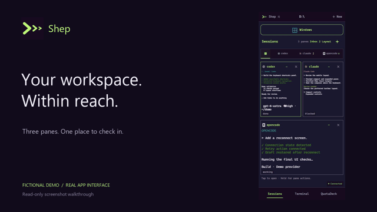
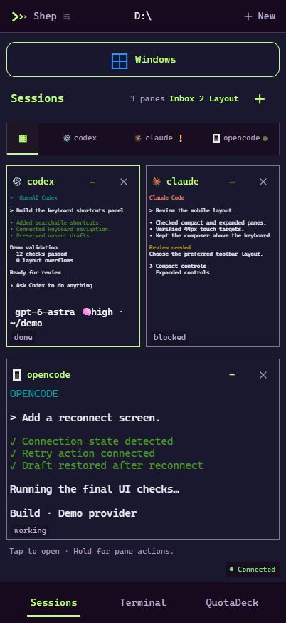
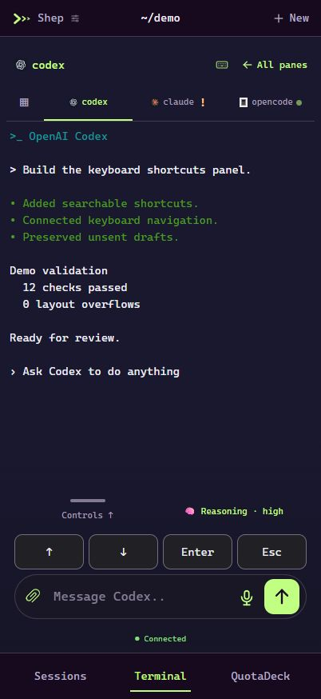
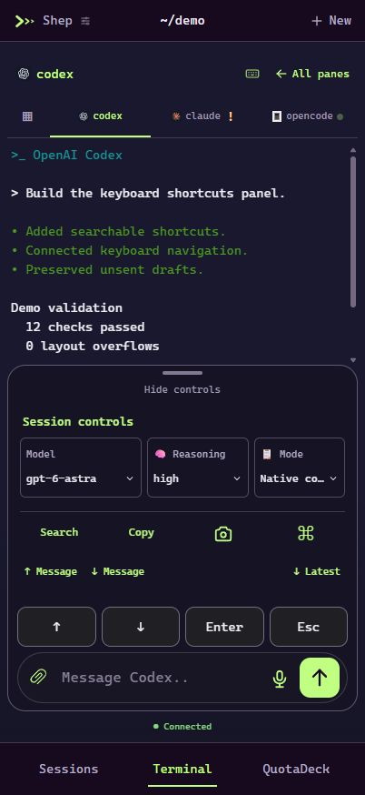

<p align="center"></p>
<h1 align="center">Shep</h1>
<p align="center"><strong>Your terminals. Within reach.</strong><br>A phone-friendly companion for Herdr.</p>
<p align="center">Live panes · Agent attention · Windows + SSH · Your own machine</p>

<p align="center"><a href="docs/video/shep-demo.mp4">▶ Watch the demo</a> · <a href="#run-locally">Run locally</a> · <a href="#what-to-expect">Current limits</a></p>

---

[](docs/video/shep-demo.mp4)

## A workspace that goes with you

Check what your agents are doing, open the pane that needs you, and send the next instruction from your phone. Shep connects to your running Herdr session through a local Node bridge.

<table><tr><td></td><td></td><td></td></tr><tr><td align="center">See the workspace</td><td align="center">Focus on one pane</td><td align="center">Keep controls close</td></tr></table>

**Demo disclosure:** Screenshots and the video use the real Shep frontend with an isolated, read-only demo backend. Tasks, model labels, statuses, and results are fictional examples, not live agent runs or benchmark results. No personal chats or credentials are shown. The video is a captioned screenshot walkthrough.

## What is inside

- **Live Sessions:** pane layouts, quick switching, minimize/restore, and local names.
- **Terminal access:** direct typing, navigation keys, search, copying, and available history.
- **Agent workflows:** independent sessions, presets, and optional pane orchestration.
- **Attention:** an inbox and Web Push alerts for completion or human attention.
- **More than one computer:** Windows and saved Herdr SSH machines, with separate UI preferences and drafts.
- **Make it yours:** the original lime-and-purple look, Silver macOS, Ghostty-inspired variants, and other built-in themes.
- **Phone input:** reviewed dictation, photo attachments, and hardware keyboard shortcuts where supported.

## Run locally

Requirements: Node.js 24+, installed Herdr, and a running Herdr session. Windows is the primary bridge host.

```sh
npm ci
npm test
npm start
```

Open **http://127.0.0.1:4317** on the bridge computer. Phone access requires a private HTTPS route to that computer; localhost on your phone is not your PC. The app has a Home Screen manifest for supported mobile browsers.

Configuration uses `HERDR_MOBILE_SESSION`, `HERDR_MOBILE_WORKSPACE`, `HERDR_MOBILE_BIN`, and `HERDR_MOBILE_PORT`. An explicit workspace limits the bridge scope. Keep private access configuration under ignored `.local/` and use your own credentials and machine settings.

`Start-Mobile.ps1` can supervise the bridge. This backup does not install a scheduled task or copy the original computer's configuration.

### Reproduce the screenshots

```sh
node scripts/demo.mjs
```

Open **http://127.0.0.1:4319**. The demo rejects terminal writes and does not connect to real agents. It uses the same frontend and server rendering path as the app.

## What to expect

This is a private development backup, not a universal compatibility guarantee.

- Agent status and available history depend on Herdr and the underlying TUI. Alternate-screen programs may not retain earlier output.
- SSH sessions currently support reading, launch, and keyboard input. Remote mouse input, file transfers, and teams are not implemented.
- Neovim's phone-fit helper currently targets local Windows Neovim with its default control pipe. Resizing changes the shared desktop editor too; custom socket arrangements may not work.
- iPhone push needs the installed Home Screen app and notification permission. The bridge and remote host must stay reachable. Actual delivery depends on the device and push service.
- Dictation, camera input, and keyboard behavior depend on browser/device support. Desktop browser emulation does not replace physical-device testing.

## Privacy and backup scope

Included: application source, tests, package lock, local assets, required notices, and synthetic demo media.

Excluded: `.local/`, installed dependencies, personal wallpapers, chats, recordings, attachments, worktrees, saved machine addresses, push keys/subscriptions, environment files, logs, and private planning/evidence documents. This is a source backup; restore your own private configuration separately.

## Authorship and notices

Maintained by the repository owner. This backup uses a single owner-authored commit and GitHub's no-reply email; no assistant co-author credit is added.

Third-party authorship and license notices remain in [THIRD-PARTY-NOTICES.md](THIRD-PARTY-NOTICES.md), [licenses](licenses), and asset license files. Theme references do not imply affiliation or endorsement. No new license for the original application code is granted by this backup.
